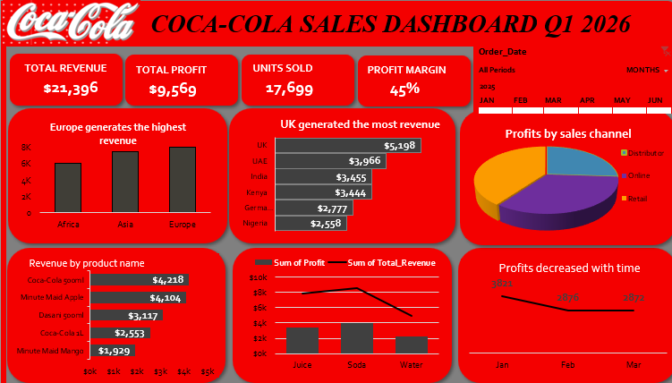

# 📊 Coca-Cola Sales Performance Dashboard

## 📌 Project Overview
This project focuses on analyzing sales data to uncover insights on revenue, profitability, and overall business performance. The goal was to simulate a real-world data analysis task and present findings through an interactive Excel dashboard.

---

## 🎯 Objectives
- Analyze sales performance across regions, products, and channels  
- Identify key drivers of revenue and profit  
- Detect underperforming areas  
- Build an interactive dashboard for decision-making  

---

## 📂 Dataset
- Simulated dataset inspired by real-world sales data  
- Contains 100+ records  

### Key Fields:
- Order Date  
- Region, Country, City  
- Product Category & Product Name  
- Sales Channel  
- Units Sold  
- Revenue, Cost, Profit, Profit Margin  

---

## 🧹 Data Cleaning
- Handled missing values (e.g. recalculated revenue where missing)  
- Standardized inconsistent text entries (e.g. sales channels)  
- Fixed mixed date formats  
- Validated calculations for profit and margins  

---

## 📊 Data Analysis
Used Pivot Tables to analyze:
- Revenue by Region  
- Profit by Product Category  
- Sales by Channel  
- Top-performing Sales Representatives  
- Trends over time  

---

## 📈 Dashboard Features
- KPI Cards:
  - Total Revenue  
  - Total Profit  
  - Profit Margin (%)  
  - Total Units Sold  

- Visualizations:
  - Column Chart → Revenue by Region  
  - Line Chart → Revenue Trend Over Time  
  - Column Chart → Product Performance  
  - Donut Chart → Sales Channel Distribution  

- Interactivity:
  - Timeline filter for dynamic date-based analysis  
  - Enables users to explore trends over time  
  - All charts update automatically based on selected time period    

---

## 🔍 Key Insights
- Some regions generated high revenue but lower profit margins  
- Retail sales channel showed stronger profitability compared to others  
- Certain products had high sales volume but lower profitability  
- Sales performance varied significantly across regions and categories  

---

## 🛠 Tools Used
- Microsoft Excel  
- Pivot Tables  
- Data Cleaning Techniques  
- Data Visualization (Charts & Dashboard)  

---

## 📸 Dashboard Preview

---

## 💡 Business Recommendations
Based on the analysis, the following actions are recommended:
- Focus on high-performing regions to maximize revenue growth while investigating causes of lower performance in underperforming regions  
- Optimize product strategy by reviewing low-profit products despite high sales volume  
- Strengthen high-performing sales channels (e.g., retail) and evaluate efficiency of lower-performing channels  
- Monitor profit margins closely to ensure revenue growth translates into actual profitability  
- Use the dashboard regularly to track performance trends and support timely, data-driven decisions  

---

## 🚀 Conclusion
This project demonstrates the end-to-end data analysis process in Excel — from data cleaning and transformation to insight generation and dashboard creation.

---

## 🔗 Author
Pauline Andege Omondi  
Data Analyst | Excel | SQL | Data Cleaning | Business Analysis

- 🔗 LinkedIn: https://www.linkedin.com/in/pauline-andege-/  
- ✍🏽 Medium: https://medium.com/@paulineandege  
- 💼 Portfolio Website: https://andegepauline.github.io/portfolio