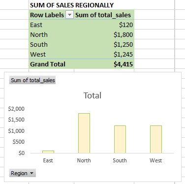
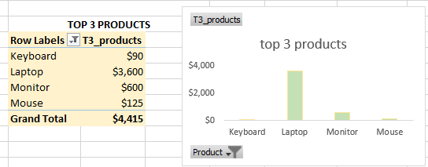
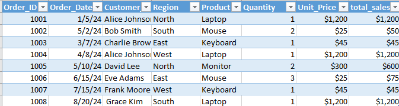

# Retail Sales Data Cleaning & Analysis (Excel Project)

## 📌 Project Overview

A small retail company exported sales data from their system, but the dataset contained inconsistencies, formatting issues, and missing values.  

The objective of this project was to:

- Clean and standardize the dataset
- Prepare it for analysis
- Generate revenue insights using PivotTables
- Present business-ready summaries

This project demonstrates foundational data cleaning and analysis skills using Microsoft Excel.

---

## 📂 Dataset

- File: `messy_retail_sales.csv`
- Records: 10
- Key Columns:
  - Order_ID
  - Order_Date
  - Customer_Name
  - Region
  - Product
  - Quantity
  - Unit_Price

The dataset intentionally contained multiple data quality issues.

---

## 🧹 Data Cleaning Process

The following issues were identified and resolved:

### 1️⃣ Inconsistent Text Formatting
- Regions had mixed casing (e.g., "south", "EAST", "West ")
- Customer names had inconsistent casing and extra spaces

✅ Solution:
- Standardized all text to Proper Case
- Removed leading and trailing spaces using Excel tools

---

### 2️⃣ Date Formatting Issues
- Dates appeared in multiple formats:
  - `2024-01-05`
  - `05/02/2024`
  - `April 8 2024`
  - `15-07-2024`
- Some values were stored as text

✅ Solution:
- Converted all entries to proper Date format using Excel’s data tools
- Standardized display format across the column

---

### 3️⃣ Missing Values
- One record missing Order_Date
- One record missing Quantity

✅ Decision:
- Rows were reviewed carefully
- Missing values were handled to ensure analysis accuracy

---

### 4️⃣ Duplicate Check
- Verified uniqueness using Order_ID
- No unintended duplicate transactions found

---

### 5️⃣ Calculated Column Added

Created:

Total_Sales = Quantity × Unit_Price

This enabled revenue-based analysis.

---

## 📊 Analysis Performed

After cleaning, PivotTables were created to answer key business questions:

### 1️⃣ Total Sales by Region

- Compared revenue performance across regions
- Identified highest revenue region


---

### 2️⃣ Top Products by Revenue

- Calculated total revenue per product
- Ranked products by total sales value


---

### 3️⃣ Cleaned Dataset Preview


---

## 📈 Key Insights

- The highest-performing region generated the most total revenue.
- One product category contributed the largest share of total sales.
- Data inconsistencies (text case, spacing, date formats) would have caused inaccurate reporting if not corrected.

---

## 🧠 Business Impact

If this dataset were used without cleaning:
- Revenue by region would have been miscalculated.
- Duplicate region labels would split totals.
- Inconsistent dates would affect time-based reporting.

Proper cleaning ensured accurate and reliable analysis.

---

## 🛠 Tools Used

- Microsoft Excel
  - Data Cleaning Tools
  - Text to Columns
  - Remove Duplicates
  - PivotTables
  - Basic Calculated Columns

---

## 📁 Project Structure

```
Retail-Sales-Data-Cleaning-in-Excel/
│
├── messy_retail_sales.csv
│
├── clean_retail_sales.xlsx
│
├── screenshots/
│   ├── cleaned_data.png
│   ├── pivot_region.png
|   ├── dashboard.png
│   └── pivot_top_products.png
│
└── README.md
```

---

## 🚀 What This Project Demonstrates

- Data cleaning fundamentals
- Structured analytical thinking
- Business-focused reporting
- Ability to turn raw data into insights

---

## 🔗 Author
Pauline Andege Omondi  
Data Analyst | Excel | SQL | Data Cleaning | Business Analysis

- 🔗 LinkedIn: https://www.linkedin.com/in/pauline-andege-/  
- ✍🏽 Medium: https://medium.com/@paulineandege  
- 💼 Portfolio Website: https://andegepauline.github.io/portfolio 
